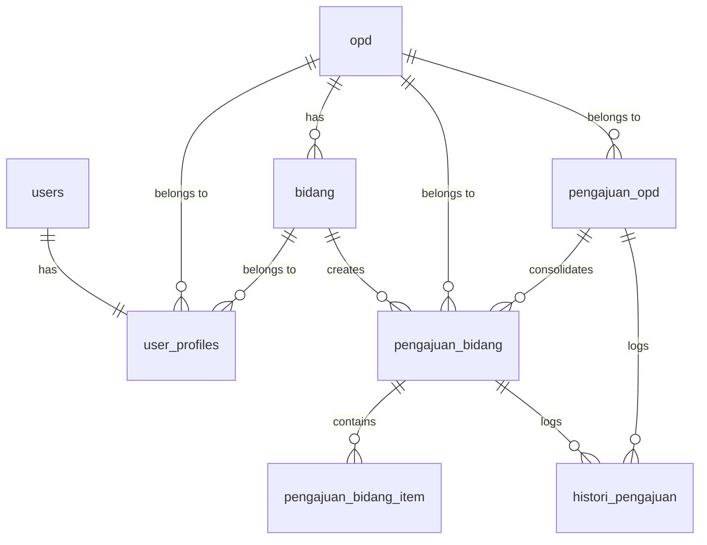

# Spesifikasi & Perencanaan Pengembangan: Aplikasi Rekomendasi Pengadaan Aset TIK

Dokumen ini berisi spesifikasi kebutuhan, desain database, alur kerja, dan panduan implementasi untuk pengembangan aplikasi **Rekomendasi Pengadaan ASET TIK** berbasis **CodeIgniter 4** dan **CodeIgniter Shield**. Dokumen ini ditujukan sebagai panduan teknis yang siap dieksekusi oleh junior programmer atau model AI.

---

## 1. Ikhtisar Aplikasi

Aplikasi Rekomendasi Pengadaan Aset TIK dirancang untuk mengelola, mereviu, dan mengonsolidasikan usulan pengadaan aset Teknologi Informasi dan Komunikasi (TIK) dari tingkat Bidang/UPTD hingga disetujui oleh Kepala DISKOMINFO dalam bentuk Surat Rekomendasi resmi.

### Daftar Aktor & Peran (Roles)
1. **Super Admin**: Memiliki kendali penuh atas sistem, termasuk manajemen pengguna, referensi data master (OPD & Bidang), dan override data pengajuan.
2. **Admin Bidang / UPTD**: Pengguna di tingkat operasional/unit kerja yang mengajukan usulan kebutuhan aset TIK.
3. **Admin OPD**: Pengguna tingkat dinas/badan yang mereviu usulan dari Bidang-Bidang di bawahnya, melakukan konsolidasi usulan, dan mengunduh surat rekomendasi jika disetujui.
4. **Kepala DISKOMINFO**: Pengguna tingkat pengambil kebijakan akhir yang mereviu usulan konsolidasi OPD dan menerbitkan Surat Rekomendasi.

---

## 2. Arsitektur & Autentikasi (CI Shield)

Aplikasi menggunakan **CodeIgniter Shield** sebagai library autentikasi dan otorisasi. 

### Konfigurasi Group & Permission
Modifikasi file `app/Config/AuthGroups.php` untuk mendefinisikan peran-peran berikut:

```php
public array $groups = [
    'superadmin' => [
        'title'       => 'Super Admin',
        'description' => 'Akses penuh ke seluruh fitur sistem.',
    ],
    'kepala_diskominfo' => [
        'title'       => 'Kepala DISKOMINFO',
        'description' => 'Reviewer akhir pengajuan OPD dan penandatangan rekomendasi.',
    ],
    'admin_opd' => [
        'title'       => 'Admin OPD',
        'description' => 'Reviewer pengajuan bidang, pengonsolidasi usulan, dan pencetak rekomendasi.',
    ],
    'admin_bidang' => [
        'title'       => 'Admin Bidang / UPTD',
        'description' => 'Pembuat usulan pengadaan aset TIK.',
    ],
];
```

---

## 3. Desain Database & Skema Tabel

Skema database dirancang untuk mendukung penyimpanan data relasional OPD, Bidang, Profil User, Detail Pengajuan, dan Histori Proses.



### DDL / SQL Migrations

#### A. Tabel Master: OPD & Bidang
```sql
CREATE TABLE `opd` (
    `id` INT UNSIGNED AUTO_INCREMENT PRIMARY KEY,
    `nama_opd` VARCHAR(255) NOT NULL,
    `kode_opd` VARCHAR(50) NOT NULL UNIQUE,
    `created_at` DATETIME DEFAULT NULL,
    `updated_at` DATETIME DEFAULT NULL
) ENGINE=InnoDB DEFAULT CHARSET=utf8mb4;

CREATE TABLE `bidang` (
    `id` INT UNSIGNED AUTO_INCREMENT PRIMARY KEY,
    `opd_id` INT UNSIGNED NOT NULL,
    `nama_bidang` VARCHAR(255) NOT NULL,
    `created_at` DATETIME DEFAULT NULL,
    `updated_at` DATETIME DEFAULT NULL,
    FOREIGN KEY (`opd_id`) REFERENCES `opd`(`id`) ON DELETE CASCADE
) ENGINE=InnoDB DEFAULT CHARSET=utf8mb4;
```

#### B. Tabel Ekstensi User: user_profiles
Menghubungkan tabel bawaan Shield (`users`) dengan OPD dan Bidang.
```sql
CREATE TABLE `user_profiles` (
    `id` INT UNSIGNED AUTO_INCREMENT PRIMARY KEY,
    `user_id` INT UNSIGNED NOT NULL UNIQUE,
    `nama_lengkap` VARCHAR(255) NOT NULL,
    `nip` VARCHAR(50) DEFAULT NULL,
    `opd_id` INT UNSIGNED DEFAULT NULL,
    `bidang_id` INT UNSIGNED DEFAULT NULL,
    `created_at` DATETIME DEFAULT NULL,
    `updated_at` DATETIME DEFAULT NULL,
    FOREIGN KEY (`user_id`) REFERENCES `users`(`id`) ON DELETE CASCADE,
    FOREIGN KEY (`opd_id`) REFERENCES `opd`(`id`) ON DELETE SET NULL,
    FOREIGN KEY (`bidang_id`) REFERENCES `bidang`(`id`) ON DELETE SET NULL
) ENGINE=InnoDB DEFAULT CHARSET=utf8mb4;
```

#### C. Tabel Pengajuan Bidang & Item Detail
```sql
CREATE TABLE `pengajuan_bidang` (
    `id` INT UNSIGNED AUTO_INCREMENT PRIMARY KEY,
    `pengajuan_opd_id` INT UNSIGNED DEFAULT NULL, -- Nullable sebelum dikonsolidasikan
    `nomor_pengajuan` VARCHAR(100) NOT NULL UNIQUE,
    `bidang_id` INT UNSIGNED NOT NULL,
    `opd_id` INT UNSIGNED NOT NULL,
    `tahun_anggaran` YEAR NOT NULL,
    `status` VARCHAR(50) NOT NULL DEFAULT 'DRAFT', 
    -- Status: DRAFT, DIAJUKAN, DISETUJUI_OPD, DITOLAK_OPD, DIKEMBALIKAN_OPD, DIPROSES_KOMINFO, DISETUJUI_KOMINFO, DITOLAK_KOMINFO, DIKEMBALIKAN_KOMINFO
    `catatan_revisi` TEXT DEFAULT NULL,
    `created_by` INT UNSIGNED NOT NULL,
    `created_at` DATETIME DEFAULT NULL,
    `updated_at` DATETIME DEFAULT NULL,
    FOREIGN KEY (`bidang_id`) REFERENCES `bidang`(`id`),
    FOREIGN KEY (`opd_id`) REFERENCES `opd`(`id`),
    FOREIGN KEY (`created_by`) REFERENCES `users`(`id`)
) ENGINE=InnoDB DEFAULT CHARSET=utf8mb4;

CREATE TABLE `pengajuan_bidang_item` (
    `id` INT UNSIGNED AUTO_INCREMENT PRIMARY KEY,
    `pengajuan_bidang_id` INT UNSIGNED NOT NULL,
    `nama_aset` VARCHAR(255) NOT NULL,
    `spesifikasi` TEXT NOT NULL,
    `jumlah` INT UNSIGNED NOT NULL,
    `satuan` VARCHAR(50) NOT NULL, -- Unit, Unit/Set, Laptop, dll
    `estimasi_harga` DECIMAL(15,2) NOT NULL,
    `kegunaan` TEXT NOT NULL,
    `created_at` DATETIME DEFAULT NULL,
    `updated_at` DATETIME DEFAULT NULL,
    FOREIGN KEY (`pengajuan_bidang_id`) REFERENCES `pengajuan_bidang`(`id`) ON DELETE CASCADE
) ENGINE=InnoDB DEFAULT CHARSET=utf8mb4;
```

#### D. Tabel Pengajuan Konsolidasi OPD
```sql
CREATE TABLE `pengajuan_opd` (
    `id` INT UNSIGNED AUTO_INCREMENT PRIMARY KEY,
    `nomor_surat_opd` VARCHAR(100) NOT NULL UNIQUE,
    `opd_id` INT UNSIGNED NOT NULL,
    `tahun_anggaran` YEAR NOT NULL,
    `status` VARCHAR(50) NOT NULL DEFAULT 'DRAFT',
    -- Status: DRAFT, DIAJUKAN, DISETUJUI, DITOLAK, DIKEMBALIKAN
    `nomor_rekomendasi` VARCHAR(100) DEFAULT NULL,
    `tanggal_rekomendasi` DATE DEFAULT NULL,
    `catatan_kominfo` TEXT DEFAULT NULL,
    `approved_by` INT UNSIGNED DEFAULT NULL, -- User ID Kepala DISKOMINFO
    `created_by` INT UNSIGNED NOT NULL, -- User ID Admin OPD
    `created_at` DATETIME DEFAULT NULL,
    `updated_at` DATETIME DEFAULT NULL,
    FOREIGN KEY (`opd_id`) REFERENCES `opd`(`id`),
    FOREIGN KEY (`approved_by`) REFERENCES `users`(`id`),
    FOREIGN KEY (`created_by`) REFERENCES `users`(`id`)
) ENGINE=InnoDB DEFAULT CHARSET=utf8mb4;
```

> [!NOTE]
> Setelah tabel `pengajuan_opd` dibuat, tambahkan constraint Foreign Key pada kolom `pengajuan_bidang.pengajuan_opd_id` yang merujuk ke `pengajuan_opd.id` dengan opsi `ON DELETE SET NULL`.

#### E. Tabel Histori Log Proses
```sql
CREATE TABLE `histori_pengajuan` (
    `id` INT UNSIGNED AUTO_INCREMENT PRIMARY KEY,
    `pengajuan_type` ENUM('bidang', 'opd') NOT NULL,
    `reference_id` INT UNSIGNED NOT NULL, -- ID dari pengajuan_bidang atau pengajuan_opd
    `status_awal` VARCHAR(50) NOT NULL,
    `status_akhir` VARCHAR(50) NOT NULL,
    `catatan` TEXT DEFAULT NULL,
    `actor_id` INT UNSIGNED NOT NULL, -- User ID yang melakukan aksi
    `created_at` DATETIME DEFAULT NULL,
    FOREIGN KEY (`actor_id`) REFERENCES `users`(`id`)
) ENGINE=InnoDB DEFAULT CHARSET=utf8mb4;
```

---

## 4. Alur Kerja Aplikasi (Workflow)

```
[Admin Bidang]                        [Admin OPD]                       [Kepala KOMINFO]
     |                                     |                                   |
     |--- (1) Buat & Kirim Pengajuan ----->|                                   |
     |                                     |                                   |
     |<-- (2a) Kembalikan / Tolak ---------|                                   |
     |                                     |                                   |
     |                                     |--- (3) Konsolidasi & Kirim ------>|
     |                                     |                                   |
     |                                     |<-- (4a) Kembalikan / Tolak -------|
     |                                     |    (Dengan Catatan)               |
     |                                     |                                   |
     |                                     |<-- (4b) Setujui (Rekomendasi) ----|
     |                                     |                                   |
     |                                     |--- (5) Cetak Surat Rekomendasi    |
```

### Detail Langkah & Transisi Status:

1. **Pengajuan oleh Admin Bidang / UPTD**:
   * Admin Bidang membuat pengajuan. Data masuk ke `pengajuan_bidang` dengan status `DRAFT`.
   * Saat dikirim ke OPD, status berubah menjadi `DIAJUKAN`.

2. **Reviu oleh Admin OPD**:
   * Admin OPD meninjau usulan dari Bidang-Bidang di bawah instansinya.
   * **Opsi A (Tolak)**: Status menjadi `DITOLAK_OPD`. Proses untuk pengajuan tersebut selesai (mati).
   * **Opsi B (Kembalikan/Revisi)**: Status menjadi `DIKEMBALIKAN_OPD` disertai `catatan_revisi`. Pengusul (Bidang) dapat mengedit kembali pengajuan lalu mengirim ulang (`status` kembali `DIAJUKAN`).
   * **Opsi C (Setuju)**: Status menjadi `DISETUJUI_OPD`. Pengajuan siap dimasukkan ke dalam keranjang konsolidasi.

3. **Konsolidasi & Pengiriman ke DISKOMINFO**:
   * Admin OPD membuat draf konsolidasi (`pengajuan_opd`) dengan mengisi nomor surat pengantar OPD dan memilih usulan Bidang yang telah `DISETUJUI_OPD`.
   * Setelah dikirim ke DISKOMINFO, status `pengajuan_opd` berubah menjadi `DIAJUKAN`, dan status seluruh `pengajuan_bidang` yang terkait otomatis berubah menjadi `DIPROSES_KOMINFO`.

4. **Reviu oleh Kepala DISKOMINFO**:
   * Kepala DISKOMINFO memeriksa draf konsolidasi OPD berserta rincian item aset dari Bidang-Bidang terkait.
   * **Opsi A (Tolak)**: Status `pengajuan_opd` menjadi `DITOLAK` dan seluruh `pengajuan_bidang` terkait menjadi `DITOLAK_KOMINFO`. Wajib menyertakan `catatan_kominfo`.
   * **Opsi B (Kembalikan/Revisi)**: Status `pengajuan_opd` menjadi `DIKEMBALIKAN` dan seluruh `pengajuan_bidang` terkait menjadi `DIKEMBALIKAN_KOMINFO`. Wajib menyertakan `catatan_kominfo` agar Admin OPD dapat merombak/mengajukan ulang usulan konsolidasi tersebut.
   * **Opsi C (Setuju)**: Status `pengajuan_opd` menjadi `DISETUJUI` dan seluruh `pengajuan_bidang` terkait menjadi `DISETUJUI_KOMINFO`. Kepala DISKOMINFO wajib menginput `nomor_rekomendasi` dan `tanggal_rekomendasi`.

5. **Penerbitan & Cetak Surat Rekomendasi**:
   * Setelah status `pengajuan_opd` menjadi `DISETUJUI`, Admin OPD dapat mengunduh atau mencetak dokumen Surat Rekomendasi resmi berformat PDF/Print-View langsung dari sistem.

---

## 5. Struktur Antarmuka & Modul Halaman

Gunakan **Bootstrap 5 & Tailwind CSS** yang sudah terkonfigurasi pada layout [default.php](file:///c:/laragon/www/vibe/app/Views/layouts/default.php).

### A. Modul Admin Bidang / UPTD
1. **Dashboard**: Ringkasan jumlah pengajuan (Draft, Diajukan, Direvisi, Disetujui).
2. **Kelola Pengajuan TIK** (`/bidang/pengajuan`):
   * Tampilan List Pengajuan beserta status terkininya.
   * Tombol *Tambah Pengajuan* (Hanya aktif jika status bukan proses reviu).
3. **Form Input Pengajuan** (`/bidang/pengajuan/create` atau `/edit/{id}`):
   * Input: Tahun Anggaran.
   * Input Dinamis Item Pengadaan (menggunakan JavaScript untuk Add/Remove Row):
     * Nama Aset (e.g. PC Desktop, Router)
     * Spesifikasi Teknis (e.g. RAM 16GB, Core i7)
     * Jumlah
     * Satuan (Unit, Unit/Set, dll)
     * Estimasi Harga Satuan
     * Kegunaan/Urgensi
4. **Detail Pengajuan & Timeline** (`/bidang/pengajuan/detail/{id}`):
   * Menampilkan rincian item usulan.
   * Menampilkan log alur perjalanan pengajuan (histori proses) yang diambil dari tabel `histori_pengajuan`.

### B. Modul Admin OPD
1. **Verifikasi Usulan Bidang** (`/opd/verifikasi`):
   * List usulan masuk dari Bidang/UPTD.
   * Halaman Detail Verifikasi: Tombol aksi *Setujui*, *Tolak* (dengan textarea catatan), dan *Kembalikan* (dengan textarea catatan).
2. **Kelola Konsolidasi** (`/opd/konsolidasi`):
   * Tampilan daftar usulan konsolidasi tingkat OPD yang telah dikirim ke DISKOMINFO beserta statusnya.
   * Form Pembuatan Konsolidasi Baru (`/opd/konsolidasi/create`):
     * Input Nomor Surat Pengantar OPD.
     * Pilihan Checkbox: Menampilkan daftar usulan bidang yang berstatus `DISETUJUI_OPD` untuk disatukan.
3. **Cetak Surat Rekomendasi** (`/opd/rekomendasi`):
   * Daftar usulan yang telah disetujui oleh Kepala DISKOMINFO.
   * Tombol *Cetak Rekomendasi* (Membuka tab baru berformat Print/PDF layout).

### C. Modul Kepala DISKOMINFO
1. **Persetujuan Usulan OPD** (`/kominfo/persetujuan`):
   * Daftar surat pengantar usulan konsolidasi masuk dari berbagai OPD (`status = DIAJUKAN`).
2. **Detail Persetujuan** (`/kominfo/persetujuan/detail/{id}`):
   * Tampilan rincian komulatif aset yang diajukan oleh OPD tersebut (dikelompokkan per bidang pengusul).
   * Tombol Aksi:
     * *Setujui*: Membuka modal input `nomor_rekomendasi` dan `tanggal_rekomendasi`.
     * *Kembalikan*: Membuka modal input `catatan_kominfo`.
     * *Tolak*: Membuka modal input `catatan_kominfo`.

### D. Modul Super Admin
1. **Manajemen OPD & Bidang** (`/admin/opd` & `/admin/bidang`):
   * CRUD data OPD dan Bidang.
2. **Manajemen Pengguna** (`/admin/users`):
   * Integrasi dengan Shield User creation.
   * Tambahan form untuk mapping `opd_id` dan `bidang_id` serta set group role (`superadmin`, `kepala_diskominfo`, `admin_opd`, `admin_bidang`).
3. **Log Histori Sistem**:
   * Monitoring log global dari `histori_pengajuan`.

---

## 6. Struktur File & Penamaan Class (CodeIgniter 4)

Gunakan struktur standar berikut di dalam direktori `app/`:

### Controllers
* `App\Controllers\Admin\OpdController.php` (Kelola data OPD)
* `App\Controllers\Admin\BidangController.php` (Kelola data Bidang)
* `App\Controllers\Admin\UserController.php` (Kelola Pengguna & Roles)
* `App\Controllers\Bidang\PengajuanController.php` (Workflow usulan bidang)
* `App\Controllers\Opd\VerifikasiController.php` (Aksi review usulan bidang)
* `App\Controllers\Opd\KonsolidasiController.php` (Aksi gabung usulan & cetak)
* `App\Controllers\Kominfo\PersetujuanController.php` (Aksi review akhir oleh Kadin)

### Models
* `App\Models\OpdModel.php`
* `App\Models\BidangModel.php`
* `App\Models\UserProfileModel.php`
* `App\Models\PengajuanBidangModel.php`
* `App\Models\PengajuanBidangItemModel.php`
* `App\Models\PengajuanOpdModel.php`
* `App\Models\HistoriPengajuanModel.php`

### Views
Kelompokkan views berdasarkan namespace modul untuk kemudahan organisasi:
* `app/Views/admin/` (opd, bidang, users)
* `app/Views/bidang/` (pengajuan/index, pengajuan/form, pengajuan/detail)
* `app/Views/opd/` (verifikasi/index, verifikasi/detail, konsolidasi/form, konsolidasi/index)
* `app/Views/kominfo/` (persetujuan/index, persetujuan/detail)
* `app/Views/rekomendasi/` (layout_cetak_pdf)

---

## 7. Panduan Langkah Implementasi Teknis

### Langkah 1: Registrasi Migrasi Database
Buat file migrasi menggunakan perintah spark:
```bash
php spark make:migration CreateAsetTikTables
```
Tulis definisi skema di dalam class migrasi tersebut sesuai dengan detail rancangan DDL di atas, lalu jalankan:
```bash
php spark migrate
```

### Langkah 2: Seeder Data Awal (Optional but Recommended)
Buat seeder untuk data instansi awal dan akun default pengguna:
* Super Admin (`admin@vibe.id`)
* Kepala DISKOMINFO (`kadin@vibe.id`)
* Admin OPD A (`adminopd.a@vibe.id`)
* Admin Bidang A1 (`adminbidang.a1@vibe.id`)
Jalankan:
```bash
php spark db:seed InitialSeeder
```

### Langkah 3: Integrasi Data Profil Pada Saat Register
Gunakan Controller override pada Shield registrasi atau buat filter/event hook untuk menyimpan detail relasi OPD/Bidang ke dalam tabel `user_profiles` saat akun baru dibuat.

### Langkah 4: Proteksi Route (Filters)
Tambahkan filter pada `app/Config/Filters.php` menggunakan filter grup bawaan Shield untuk membatasi akses:
```php
$routes->group('bidang', ['filter' => 'group:superadmin,admin_bidang'], function($routes) {
    $routes->get('pengajuan', 'Bidang\PengajuanController::index');
    // ... route bidang lainnya
});

$routes->group('opd', ['filter' => 'group:superadmin,admin_opd'], function($routes) {
    $routes->get('verifikasi', 'Opd\VerifikasiController::index');
    // ... route opd lainnya
});

$routes->group('kominfo', ['filter' => 'group:superadmin,kepala_diskominfo'], function($routes) {
    $routes->get('persetujuan', 'Kominfo\PersetujuanController::index');
    // ... route kominfo lainnya
});
```

### Langkah 5: Logika Transisi Status di Model/Controller
Pastikan setiap terjadi perubahan status pengajuan (misal dari DRAFT ke DIAJUKAN, atau saat OPD menyetujui), sistem secara otomatis menyisipkan satu baris baru ke tabel `histori_pengajuan` dengan format:
```php
$historiModel->insert([
    'pengajuan_type' => 'bidang',
    'reference_id'   => $pengajuanBidangId,
    'status_awal'    => $statusLama,
    'status_akhir'   => $statusBaru,
    'catatan'        => $catatan,
    'actor_id'       => auth()->id()
]);
```

### Langkah 6: Template Surat Rekomendasi (PDF/Print View)
Buat view khusus `rekomendasi/layout_cetak_pdf` yang bersih tanpa navbar/sidebar, menggunakan CSS `@media print` agar rapi saat dicetak menggunakan pintasan print browser (`window.print()`). Pastikan memuat:
* Kop Surat Resmi Pemerintah/DISKOMINFO.
* Nomor Surat Rekomendasi (diambil dari `pengajuan_opd.nomor_rekomendasi`).
* Tabel daftar gabungan aset TIK yang disetujui (Nama Aset, Spesifikasi, Jumlah, Satuan, Kegunaan).
* Tanda tangan Kepala DISKOMINFO (menggunakan tanggal persetujuan).

---

## 8. Kriteria Penerimaan (Acceptance Criteria)

1. **Keamanan Role & Data**:
   * Admin Bidang HANYA bisa melihat & mengelola usulan milik bidangnya sendiri.
   * Admin OPD HANYA bisa melihat & mengonfirmasi usulan dari bidang-bidang yang bernaung di bawah OPD-nya sendiri.
   * Kepala DISKOMINFO bisa melihat usulan dari seluruh OPD, tetapi tidak bisa membuat usulan baru.
2. **Kemandirian Item**: Admin OPD bisa menolak atau meminta revisi per berkas usulan bidang.
3. **Validasi Mandatori Catatan**: Sistem HARUS menolak aksi jika Kepala DISKOMINFO atau Admin OPD memilih tindakan *Tolak* atau *Kembalikan* tanpa mengisi Catatan/Alasan.
4. **Histori Jejak Audit**: Setiap usulan memiliki rekam jejak status yang presisi di halaman detail (siapa yang mengajukan, kapan disetujui OPD, catatan revisi dari Kadin, dll).
5. **Cetak Surat Rekomendasi**: Output rekomendasi tercetak dengan format kop surat resmi dan hanya menampilkan item-item pengadaan yang telah disetujui secara final.
