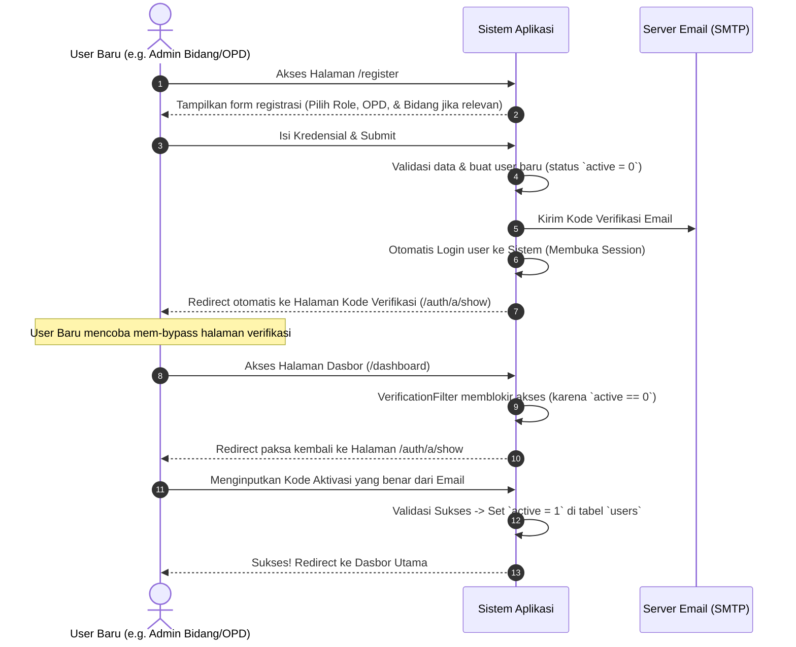

# Perencanaan Detail Pengembangan: Refaktorisasi Registrasi & Struktur Database Pengguna (Aplikasi Rekomendasi Aset TIK)

## 📌 Deskripsi Tugas & Tujuan
Refaktorisasi modul autentikasi dan otorisasi aplikasi menggunakan **CodeIgniter Shield** dengan ketentuan baru:
1. Mengembalikan struktur database asli Shield (`users` table) dan memodifikasinya dengan menambahkan kolom `kd_opd` dan `kd_bidang` secara langsung ke tabel `users` (menghapus tabel `user_profiles` agar lebih efisien).
2. Menyediakan proses registrasi terproteksi:
   * **Admin Bidang dan Admin OPD**: dapat melakukan registrasi mandiri dan memilih role-nya.
   * **Kepala DISKOMINFO**: Hanya bisa didaftarkan oleh **Super Admin**.
3. Mengatur alur verifikasi email pasca-registrasi:
   * Menghilangkan pembatasan validasi email pada proses login default Shield (proses login berhasil dilakukan meskipun belum aktif).
   * Membaca status aktivasi melalui filter rute kustom (`VerificationFilter`). Jika pengguna masuk dan belum memverifikasi email, mereka langsung diarahkan ke layar input kode aktivasi sebelum dapat mengakses dasbor.

---

## 📂 Komponen & Langkah Kerja Detail

### Bagian 1: Migrasi Database & Struktur Tabel `users`
Kita akan memulihkan tabel bawaan Shield dan menambahkan kolom relasional langsung ke tabel `users`.

#### 1. Jalankan Migrasi Shield Bawaan
Junior programmer harus memastikan migrasi asli Shield berjalan tanpa perubahan pada kolom bawaan:
```bash
php spark migrate --all
```

#### 2. Buat Migrasi Kustom Tambahan: `AddOpdFieldsToUsersTable`
Buat file migrasi baru untuk menambahkan kolom `kd_opd` dan `kd_bidang` dengan foreign key ke tabel `opd` dan `bidang`.
* **File Kunci**: `app/Database/Migrations/[TIMESTAMP]_AddOpdFieldsToUsersTable.php`

```php
<?php

namespace App\Database\Migrations;

use CodeIgniter\Database\Migration;

class AddOpdFieldsToUsersTable extends Migration
{
    public function up()
    {
        $fields = [
            'kd_opd' => [
                'type'       => 'VARCHAR',
                'constraint' => 50,
                'null'       => true,
                'after'      => 'username'
            ],
            'kd_bidang' => [
                'type'       => 'VARCHAR',
                'constraint' => 50,
                'null'       => true,
                'after'      => 'kd_opd'
            ],
        ];
        
        $this->forge->addColumn('users', $fields);
        
        // Tambahkan Foreign Key
        $this->forge->addForeignKey('kd_opd', 'opd', 'kd_opd', 'CASCADE', 'SET NULL', 'users_kd_opd_fk');
        $this->forge->addForeignKey('kd_bidang', 'bidang', 'kd_bidang', 'CASCADE', 'SET NULL', 'users_kd_bidang_fk');
    }

    public function down()
    {
        $this->forge->dropForeignKey('users', 'users_kd_opd_fk');
        $this->forge->dropForeignKey('users', 'users_kd_bidang_fk');
        $this->forge->dropColumn('users', ['kd_opd', 'kd_bidang']);
    }
}
```

#### 3. Update Model & Entitas User (`UserModel`)
Daftarkan field baru agar dapat dibaca dan dimanipulasi oleh model bawaan Shield.
* **File Kunci**: `app/Models/UserModel.php` atau extends `CodeIgniter\Shield\Models\UserModel`:
```php
<?php

namespace App\Models;

use CodeIgniter\Shield\Models\UserModel as ShieldUserModel;

class UserModel extends ShieldUserModel
{
    protected function initialize(): void
    {
        parent::initialize();
        
        // Tambahkan field kustom ke allowed fields
        $this->allowedFields = array_merge($this->allowedFields, [
            'kd_opd',
            'kd_bidang'
        ]);
    }
}
```

---

### Bagian 2: Autentikasi Tanpa Validasi Email Saat Login (Bypass Login Activation)
Secara bawaan, Shield memblokir login jika pengguna belum diaktifkan (`active = 0`). Kita akan mengubah perilaku ini agar login berhasil, namun akses fitur dibatasi oleh Filter.

#### 1. Konfigurasi Tindakan Aktivasi di `app/Config/Auth.php`
Pastikan tindakan aktivasi pasca registrasi tetap menyala:
```php
public array $actions = [
    'register' => \CodeIgniter\Shield\Actions\EmailActivator::class,
    'login'    => null, // Matikan validasi email saat login bawaan
];
```

#### 2. Buat Filter Validasi Email Kustom (`VerificationFilter`)
Filter ini akan memeriksa apakah pengguna yang sedang login sudah memverifikasi emailnya. Jika belum, mereka akan langsung dialihkan ke halaman verifikasi.
* **File Kunci**: `app/Filters/VerificationFilter.php`

```php
<?php

namespace App\Filters;

use CodeIgniter\Filters\FilterInterface;
use CodeIgniter\HTTP\RequestInterface;
use CodeIgniter\HTTP\ResponseInterface;

class VerificationFilter implements FilterInterface
{
    public function before(RequestInterface $request, $arguments = null)
    {
        $auth = service('auth');
        
        if ($auth->loggedIn()) {
            $user = $auth->user();
            
            // Jika user belum aktif (belum memverifikasi email)
            if (!$user->active) {
                // Kecuali untuk halaman verifikasi itu sendiri
                $currentRoute = $request->getUri()->getPath();
                if ($currentRoute !== 'auth/a/show' && $currentRoute !== 'auth/a/verify') {
                    return redirect()->to(base_url('auth/a/show'))
                                     ->with('error', 'Silakan masukkan kode verifikasi yang telah dikirim ke email Anda.');
                }
            }
        }
    }

    public function after(RequestInterface $request, ResponseInterface $response, $arguments = null)
    {
        // No action needed
    }
}
```

#### 3. Registrasi Filter di `app/Config/Filters.php`
Daftarkan filter ini agar mengamankan seluruh rute utama (dasbor, usulan, dll) kecuali rute autentikasi bawaan.
```php
public array $aliases = [
    // ...
    'verification' => \App\Filters\VerificationFilter::class,
];

public array $filters = [
    'verification' => ['before' => ['dashboard*', 'bidang*', 'opd*', 'kominfo*', 'admin*']],
];
```

---

### Bagian 3: Alur Registrasi Per-Peran Terproteksi & Mandiri
Kita akan mengatur ulang proses registrasi sesuai spesifikasi terbaru.

#### 1. Skema Akses Registrasi
| Peran Target | Tipe Registrasi | Pengakses | Input Data Tambahan |
| :--- | :--- | :--- | :--- |
| **Admin Bidang** | Mandiri | Publik (`/register`) | `role = admin_bidang`, `kd_opd`, `kd_bidang` |
| **Admin OPD** | Mandiri | Publik (`/register`) | `role = admin_opd`, `kd_opd` |
| **Kepala DISKOMINFO** | Terproteksi | Super Admin (`/admin/register-kadin`) | Otomatis terhubung dengan `kd_opd` Diskominfo |

#### 2. Definisikan Rute di `app/Config/Routes.php`
Menimpa default Register controller bawaan Shield untuk registrasi mandiri, dan menambahkan rute admin khusus.
```php
// Rute Registrasi Mandiri (Admin OPD / Admin Bidang)
$routes->get('register', '\App\Controllers\Auth\RegisterController::registerView');
$routes->post('register', '\App\Controllers\Auth\RegisterController::registerAction');

// Rute Registrasi Terproteksi (Kepala DISKOMINFO oleh Super Admin)
$routes->group('admin', ['filter' => 'group:superadmin'], function($routes) {
    $routes->get('register-kadin', 'Admin\UserController::showRegisterKadinForm');
    $routes->post('register-kadin', 'Admin\UserController::processRegisterKadin');
});
```

#### 3. Logika Proses Registrasi (Backend)

##### A. Registrasi Mandiri Admin Bidang / Admin OPD
Kustomisasi Controller `RegisterController` untuk menangani pilihan role dan relasi OPD/Bidang.
* **File Kunci**: `app/Controllers/Auth/RegisterController.php` (Extend `CodeIgniter\Shield\Controllers\RegisterController`)

```php
<?php

namespace App\Controllers\Auth;

use CodeIgniter\Shield\Controllers\RegisterController as ShieldRegister;
use App\Models\UserModel;

class RegisterController extends ShieldRegister
{
    public function registerView()
    {
        // Tampilkan form registrasi kustom velzone dengan drop-down OPD dan Bidang
        $opdModel = new \App\Models\OpdModel();
        $bidangModel = new \App\Models\BidangModel();
        
        return view('auth/register', [
            'opd_list' => $opdModel->findAll(),
            'bidang_list' => $bidangModel->findAll(),
        ]);
    }

    public function registerAction()
    {
        // 1. Aturan Validasi Kustom
        $rules = [
            'username' => 'required|alpha_numeric_space|min_length[3]|max_length[30]|is_unique[users.username]',
            'email'    => 'required|valid_email|is_unique[auth_identities.secret]',
            'password' => 'required|strong_password',
            'role'     => 'required|in_list[admin_opd,admin_bidang]',
            'kd_opd'   => 'required',
            'kd_bidang'=> 'required_without[role,admin_opd]', // Wajib diisi jika rolenya adalah admin_bidang
        ];

        if (!$this->validate($rules)) {
            return redirect()->back()->withInput()->with('errors', $this->validator->getErrors());
        }

        // 2. Buat User & Simpan Langsung ke Kolom Tabel `users`
        $users = model(UserModel::class);
        $role = $this->request->getPost('role');
        
        $newUser = new \CodeIgniter\Shield\Entities\User([
            'username'  => $this->request->getPost('username'),
            'email'     => $this->request->getPost('email'),
            'password'  => $this->request->getPost('password'),
            'kd_opd'    => $this->request->getPost('kd_opd'),
            'kd_bidang' => ($role === 'admin_bidang') ? $this->request->getPost('kd_bidang') : null,
            'active'    => 0, // Akun belum aktif, wajib verifikasi email
        ]);

        $users->save($newUser);
        $newUser = $users->findById($users->getInsertID());

        // 3. Tambahkan Grup Role Shield
        $newUser->addGroup($role);

        // 4. Trigger Email Aktivasi
        $activator = service('auth')->getActivator();
        $activator->send($newUser);

        // 5. Otomatis login dan arahkan ke layar pengisian token email
        auth()->login($newUser);

        return redirect()->to(base_url('auth/a/show'))
                         ->with('message', 'Registrasi sukses! Kode aktivasi telah dikirim ke email Anda.');
    }
}
```

##### B. Registrasi Kepala DISKOMINFO (Oleh Super Admin)
Hanya bisa diakses oleh Super Admin untuk mendaftarkan Kepala Dinas.
* **File Kunci**: `app/Controllers/Admin/UserController.php`

```php
public function processRegisterKadin()
{
    $rules = [
        'username' => 'required|alpha_numeric_space|min_length[3]|max_length[30]|is_unique[users.username]',
        'email'    => 'required|valid_email|is_unique[auth_identities.secret]',
        'password' => 'required|strong_password',
    ];
    
    if (!$this->validate($rules)) {
        return redirect()->back()->withInput()->with('errors', $this->validator->getErrors());
    }
    
    $users = model(UserModel::class);
    $newUser = new \CodeIgniter\Shield\Entities\User([
        'username'  => $this->request->getPost('username'),
        'email'     => $this->request->getPost('email'),
        'password'  => $this->request->getPost('password'),
        'kd_opd'    => 'OPD-KOMINFO', // Otomatis terikat dengan DISKOMINFO
        'kd_bidang' => null,
        'active'    => 0,
    ]);
    
    $users->save($newUser);
    $newUser = $users->findById($users->getInsertID());
    
    // Tambahkan grup role 'kepala_diskominfo'
    $newUser->addGroup('kepala_diskominfo');
    
    // Trigger Pengiriman Email Aktivasi
    $activator = service('auth')->getActivator();
    $activator->send($newUser);
    
    return redirect()->back()->with('success', 'Kepala DISKOMINFO berhasil didaftarkan. Email verifikasi telah dikirim.');
}
```

---

### Bagian 4: Skema Alur Pengalaman Pengguna (UX Flow)
Berikut adalah visualisasi alur registrasi & validasi mandiri:



---

## 🧪 Rencana Verifikasi & Pengujian (QA Plan)

### 1. Pengujian Database
* Pastikan kolom `kd_opd` dan `kd_bidang` ada di tabel `users` setelah migrasi.
* Cek foreign key constraints: memastikan relasi ke tabel `opd` dan `bidang` terjaga dengan opsi `SET NULL` saat data referensi dihapus.

### 2. Pengujian Otorisasi Registrasi Mandiri
* Akses `/register` tanpa login -> Form harus tampil dan mengizinkan pengisian role (`admin_bidang` atau `admin_opd`).
* Coba pilih `admin_bidang` tanpa menyertakan `kd_bidang` -> Validasi harus menolak.
* Coba pilih `admin_opd` -> `kd_bidang` otomatis tidak diperlukan.

### 3. Pengujian Otorisasi Pendaftaran Kadin
* Masuk sebagai **Admin OPD** atau **Admin Bidang**, akses URL `/admin/register-kadin` -> Harus diblokir (403 / Redirect ke login).
* Masuk sebagai **Super Admin**, akses URL `/admin/register-kadin` -> Berhasil terbuka dan dapat mendaftarkan Kepala Dinas.

### 4. Pengujian Alur Validasi Email
* Setelah melakukan registrasi mandiri -> Halaman harus langsung diredirect ke `/auth/a/show`.
* Buka browser di tab samaran, coba login menggunakan akun baru yang terdaftar -> Proses login sukses dilakukan, namun saat masuk ke rute dasbor langsung diarahkan kembali ke `/auth/a/show` oleh `VerificationFilter`.
* Input kode verifikasi yang salah -> Harus memunculkan error validasi.
* Input kode verifikasi yang benar -> Akun teraktivasi (`active = 1`), user berhasil mengakses dasbor.
